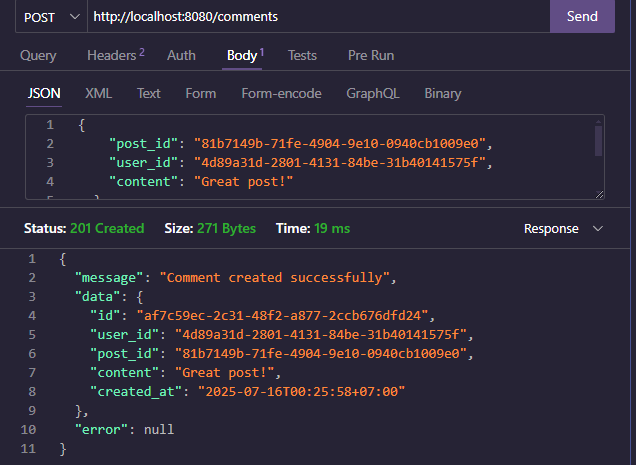

# Social Media API
REST API sederhana untuk simulasi aplikasi media sosial menggunakan Go, Gin framework, dan PostgreSQL database.

## Arsitektur Aplikasi

Aplikasi ini menggunakan arsitektur **Clean Architecture** dengan pemisahan yang jelas antara layer:

### 1. **Models Layer** (`models/`)
- Berisi definisi struct untuk data entities
- Tidak memiliki dependency ke layer lain
- Contoh: `User`

### 2. **Database Layer** (`database/`)
- Mengelola koneksi database
- Setup dan migrasi tabel
- Isolated dari business logic

### 3. **Services Layer** (`services/`)
- Berisi business logic aplikasi
- Validasi data dan aturan bisnis
- Interface antara controllers dan database

### 4. **Controllers Layer** (`controllers/`)
- HTTP handlers yang menangani request/response
- Parsing input dan formatting output
- Memanggil services untuk business logic

### 5. **Routes Layer** (`routes/`)
- Definisi endpoint dan routing
- Mapping URL ke controller functions
- Grouping routes by feature

### 6. **Middleware Layer** (`middleware/`)
- Cross-cutting concerns (CORS, logging, auth, dll)
- Request/response interceptors
- Reusable components

### 7. **Utils Layer** (`utils/`)
- Helper functions dan utilities
- Validation functions
- Common reusable code

### 8. **Config Layer** (`config/`)
- Application configuration
- Environment variables management
- Centralized config loading

## Struktur Project

```
social-media-api/
├── config/
│   └── config.go           # Konfigurasi aplikasi
├── controllers/
│   └── user_controller.go  # HTTP handlers untuk user endpoints
├── database/
│   └── connection.go       # Database connection dan setup
├── middleware/
│   └── middleware.go       # Middleware untuk CORS, logging, dll
├── models/
│   └── user.go            # Data models dan structs
├── routes/
│   └── routes.go          # Route definitions
├── services/
│   └── user_service.go    # Business logic layer
├── utils/
│   └── validation.go      # Utility functions
├── main.go                # Entry point aplikasi
├── go.mod                 # Go module definition
├── docker-compose.yml     # Docker setup untuk PostgreSQL
├── env.example           # Environment variables template
├── postman_collection.json # Postman collection untuk testing
└── README.md             # Dokumentasi
```

## Prerequisites

- Go 1.21 atau lebih baru
- PostgreSQL database
- Postman atau curl untuk testing

## Setup Database

### Option 1: PostgreSQL Lokal

1. **Install PostgreSQL** di Windows:
   - Download dari: https://www.postgresql.org/download/windows/
   - Install dengan default settings

2. **Buat database**:
   ```sql
   -- Buka psql atau pgAdmin
   CREATE DATABASE social_media;
   ```

3. **Setup environment variables**:
   ```bash
   # Copy file .env.example ke .env
   cp env.example .env
   
   # Edit file .env sesuai dengan setup PostgreSQL lokal Anda:
   DB_HOST=localhost
   DB_PORT=5432
   DB_USER=postgres
   DB_PASSWORD=yourpassword
   DB_NAME=social_media
   DB_SSLMODE=disable
   ```

## Installation

1. **Install PostgreSQL** (jika belum ada):
   - Download dari https://www.postgresql.org/download/windows/
   - Atau gunakan Docker (opsional)

2. **Clone/setup project**:
   ```bash
   cd social-media-api
   ```

3. **Setup environment variables**:
   ```bash
   # Copy template .env
   copy env.example .env
   
   # Edit .env file dengan info database Anda:
   # DB_HOST=localhost
   # DB_PORT=5432
   # DB_USER=postgres
   # DB_PASSWORD=yourpassword
   # DB_NAME=social_media
   ```

4. **Download dependencies**:
   ```bash
   go mod tidy
   ```

5. **Jalankan aplikasi**:
   ```bash
   go run .
   ```

Server akan berjalan di `http://localhost:8080`

## API Endpoints

### User Management

#### 1. POST /users - Registrasi user baru
- Request OK

- Email Kosong

- User Kosong


#### 2. GET /users - Ambil semua user


#### 3. GET /users/:id - Ambil profil user


#### 4. PUT /users/:id - Update profil user


#### 5. DELETE /users/:id - Hapus user


### Post Management

#### 1. POST /posts - Buat post baru
- User Not Valid

- Content Kosong

- Post Berhasil


#### 2. GET /posts - Ambil semua post 


#### 3. GET /posts/:id - Ambil post berdasarkan ID


### 4. DELETE /users/:id/posts - Ambil semua post dari satu user


#### 5. DELETE /posts/:id - Hapus post


### Like Management

#### 1. POST /likes - Like Post
- Successfull Add Like


- Failed Add Like


#### 2. GET /posts/:id/likes - Get likes by post ID


#### 3 GET /users/:id/likes – Lihat semua like dari seorang user


### Comment Management

#### 1. POST /comments - Buat comment baru

#### 2. GET /posts/:id/comments - Ambil semua comment dari post


### Follow Management

#### 1. POST /follows - Follow user


#### 2. DELETE /follows - Unfollow user


### User-Related Endpoints

#### 1. GET /users/:id/posts - Ambil semua post dari user


#### 2. GET /users/:id/likes - Ambil semua like dari user


#### 3. GET /users/:id/followers - Ambil followers user


#### 4. GET /users/:id/following - Ambil user yang diikuti


## Data Structure

### User
```go
type User struct {
    ID       string `json:"id"`
    Username string `json:"username"`
    Email    string `json:"email"`
    Bio      string `json:"bio"`
}
```

### Post
```go
type Post struct {
    ID      string `json:"id"`
    UserID  string `json:"user_id"`
    Content string `json:"content"`
}
```

### Like
```go
type Like struct {
    ID     string `json:"id"`
    UserID string `json:"user_id"`
    PostID string `json:"post_id"`
}
```

### Comment
```go
type Comment struct {
    ID      string `json:"id"`
    UserID  string `json:"user_id"`
    PostID  string `json:"post_id"`
    Content string `json:"content"`
}
```

### Follow
```go
type Follow struct {
    ID          string `json:"id"`
    FollowerID  string `json:"follower_id"`
    FollowingID string `json:"following_id"`
}
```

### Response Format
```go
type Response struct {
    Status  string      `json:"status"`
    Message string      `json:"message"`
    Data    interface{} `json:"data,omitempty"`
}
```

## Validasi Input

- **Username**: Wajib diisi
- **Email**: Wajib diisi dan harus format email yang valid
- **Bio**: Opsional
- **Content**: Wajib diisi untuk post dan comment
- **ID**: Auto-generate menggunakan UUID


## Status Codes

- `200 OK`: Request berhasil
- `201 Created`: Resource berhasil dibuat
- `400 Bad Request`: Input tidak valid
- `404 Not Found`: Resource tidak ditemukan
- `409 Conflict`: Conflict (username/email sudah ada)
- `500 Internal Server Error`: Server error

## Testing dengan Postman

1. Import collection berikut ke Postman
2. Set base URL: `http://localhost:8080`
3. Test semua endpoint sesuai dokumentasi di atas

## Environment Variables

- `DATABASE_URL`: Connection string PostgreSQL
- `PORT`: Port server (default: 8080)

